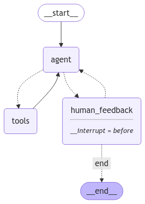

# Skincare AI Chatbot

A sophisticated AI-powered skincare consultant using LangChain LangGraph, FastAPI, and Pinecone. This chatbot provides personalized skincare advice, analyzes images, and suggests routines based on AI-driven assessments. It also supports **voice-based conversations** using **Whisper** for speech recognition and **ElevenLabs** for speech synthesis.

## Features

- **AI-Powered Skincare Assistant**: Provides personalized skincare recommendations based on user input.
- **Image-Based Skin Analysis**: Uses AI to analyze skin conditions from uploaded images.
- **Voice Conversation Support**: Integrates Whisper for voice input processing and ElevenLabs for natural-sounding voice responses.
- **Agentic Framework**: Utilizes an agentic approach, chaining different tools together for enhanced interactions.
- **Vector Database Integration**: Utilizes Pinecone for efficient similarity search and knowledge retrieval.
- **Web Search Capability**: Integrates with Tavily for real-time skincare-related searches.
- **FastAPI Backend**: High-performance API with automatic OpenAPI documentation.
- **Streamlit Frontend**: User-friendly web interface for chatbot interaction.
- **Comprehensive Logging**: Detailed logs for monitoring and debugging.

## Prerequisites

- Python 3.12+
- Poetry (for dependency management)
- API Keys:
  - `GROQ_API_KEY`
  - `PINECONE_API_KEY`
  - `TAVILY_API_KEY`
  - `OPENAI_API_KEY`
  - `ELEVEN_LAB_API_KEY`

### Agentic Flow & Architecture



## Installation

### Local Development

1. Clone the repository:
   ```bash
   git clone https://github.com/Gershonbest/support-agent.git
   cd skincare-ai-chatbot
   ```

2. Install Poetry if you haven't already:
   ```bash
   pip install poetry
   ```

3. Install dependencies using Poetry:
   ```bash
   poetry install
   ```

4. Activate the virtual environment:
   - For older versions of Poetry:
     ```bash
     poetry shell
     ```
   - For the latest version of Poetry:
     ```bash
     eval $(poetry env activate)
     ```

5. Set up environment variables:
   Create a `.env` file in the root directory with the following variables:
   ```
   GROQ_API_KEY=your_groq_api_key
   PINECONE_API_KEY=your_pinecone_api_key
   TAVILY_API_KEY=your_tavily_api_key
   OPENAI_API_KEY=your_openai_api_key
   ELEVEN_LAB_API_KEY=your_eleven_lab_api_key
   ```

### Running the Application

To start both the **FastAPI backend** and **Streamlit frontend**, simply run:

```bash
python main.py
```

This will automatically start the backend and frontend together.

### API Endpoints

#### Health Check
```
GET /health
```
Returns the current health status of the service.

#### Chat Endpoint
```
POST /chat
```
Accepts chat messages and returns AI responses.

Request body:
```json
{
    "message": "string",
    "thread_id": "optional[int]"
}
```

## Development

### Adding New Tools

1. Create a new tool function in `src/agent_tools.py`:
   ```python
   @tool
   def new_tool(parameter: str):
       """Tool description"""
       # Implementation
       return result
   ```

2. Register the tool in `src/agent.py`.

### Extending Vector Database

1. Add new methods to `PineconeManagment` class in `src/vector_database/vector_db.py`.
2. Update validators in `src/validators/pinecone_validators.py` if needed.

## License

This project is licensed under the MIT License.